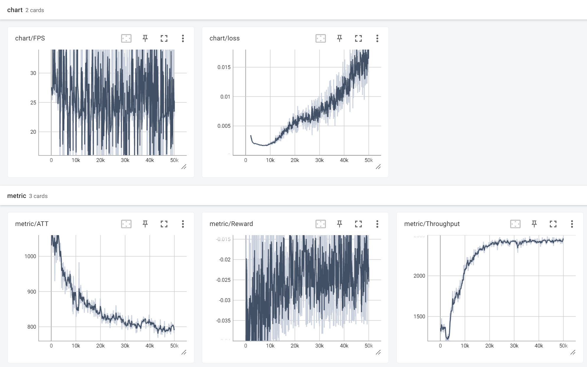

# MOSS Optimization Showcases

## Requirements

```bash
pip install -r requirements.txt
```

## Traffic Signal Control

Code and datasets are inside `./traffic_signal_control`.

The `hangzhou` dataset contains 16 junctions. The `manhattan` dataset contains 48 junctions.

To visualize the datasets, use `visualize.ipynb`

To run baseline algorithms:
```bash
# Fixed time traffic signal control
python run_baseline.py --algo fixed_time --data data/hangzhou
# Max pressure traffic signal control
python run_baseline.py --algo max_pressure --data data/hangzhou
# SOTL traffic signal control
python run_baseline.py --algo sotl --data data/hangzhou
# Builtin version of fixed_time
python run_baseline.py --algo ft_builtin --data data/hangzhou
# Builtin version of max_pressure (considers phase fairness, different from above)
python run_baseline.py --algo mp_builtin --data data/hangzhou
```

To train DQN:
```bash
python run_dqn.py --data data/hangzhou
```
The training process can be visualized with `tensorboard`. For example,

